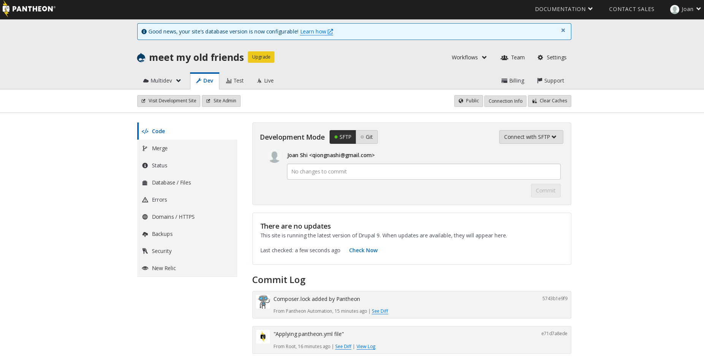

# :bowtie:meet-my-old-friends
Build my personal website in Drupal 9 to show my strength in Drupal, hosting it on Pantheon.
https://dev-meet-my-old-friends.pantheonsite.io/. Steps see below. 

### 1. Sign up a free account at Pantheon 
https://pantheon.io/register They offer you: 2 free sandbox sites; Git-Based Dev, Test, And Live Environments; Free HTTPS (SSL) Certificates; Integrated Content Delivery Network (CDN)

### 2. Create a Sandbox site on Pantheon
https://pantheon.io/docs/guides/quickstart/create-new-site/ When done, you should see your site like this: 
 

### 3. Deploy Drupal 9
 

### 4. Generate SSH keys in your terminal and add it to Pantheon
https://pantheon.io/docs/ssh-keys

### 5. Git clone the repo from Pantheon to your local machine 
When done, the repo structure will look like this


### 6. Say goodbye to one of your old friends - Acquia Dev Desktop 

Acquia has stopped support for Dev Desktop on June 30, 2021. Completely uninstall it in your local machine. 
https://www.revouninstaller.com/preview-log/?pid=2469&pname=Acquia+Dev+Desktop

### 7. Install Composer 2 globally 
https://getcomposer.org/download/

### 8. Install Drupal theme which suits your need
I pick dxpr at this moment as it is free and I expect it is scalable https://www.drupal.org/project/dxpr_theme

Run the following command line in your terminal:
```
composer require drupal/dxpr_theme
```

### 9. Set the theme you just installed as the default one


### 10. Install some common used contrib modules to have better admin experience

E.g. admin_toolbar: https://www.drupal.org/project/admin_toolbar. Run in the terminal with this pattern
```
composer require drupal/project_name
```
In this case it will be
```
composer require drupal/admin_toolbar
```

Remember to visit https://dev-meet-my-old-friends.pantheonsite.io/admin/modules to install it once you git commit to the remote


### 11. Contrib modules list I have installed for this project

* Bullet list https://www.drupal.org/project/admin_toolbar
* Bullet list https://www.drupal.org/project/paragraphs